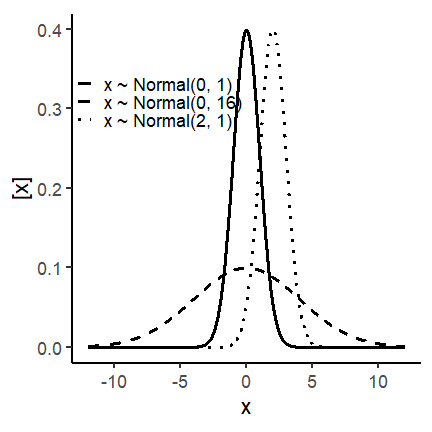
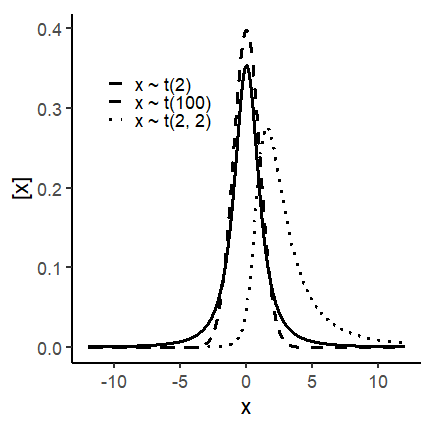
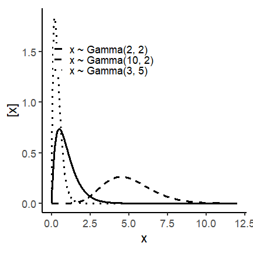
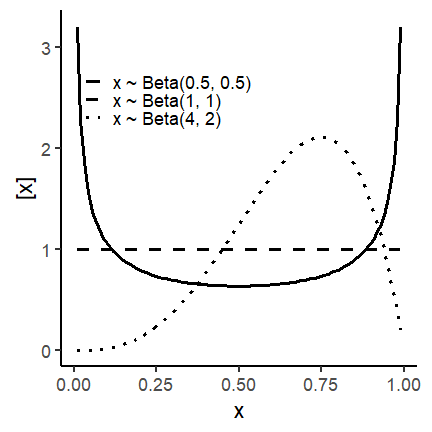


Mixed-effects models combine fixed effects and random effects. 
Assuming $$\mathbf{y}$$ arises from a normal distribution, 
we can define a mixed-effects model as 

$$\mathbf{y} = \mathbf{X} \boldsymbol{\beta} + \mathbf{Z}\mathbf{u} + \boldsymbol{\varepsilon}, \\ 
\begin{bmatrix}\mathbf{u} \\ \boldsymbol{\varepsilon} \end{bmatrix} \sim \left(
\begin{bmatrix}\boldsymbol{0} \\ \boldsymbol{0} \end{bmatrix}, 
\begin{bmatrix}\mathbf{G} & \boldsymbol{0} \\
\boldsymbol{0} & \mathbf{R} \end{bmatrix} 
\right),$$

where $$\mathbf{y}$$ is the observed response, 
$$\mathbf{X}$$ is the matrix with the explanatory variables, 
$$\mathbf{Z}$$ is the design matrix,
$$\boldsymbol{\beta}$$ is the vector containing the fixed-effects parameters, 
$$\mathbf{u}$$ is the vector containing the random effects parameters, 
$$\boldsymbol{\varepsilon}$$ is the vector containing the residuals, 
$$\mathbf{G}$$ is the variance-covariance matrix of the random effects, 
and $$\mathbf{R}$$ is the variance-covariance matrix of the residuals. 
Typically, $$\mathbf{G} = \sigma^2_u \mathbf{I}$$ and $$\mathbf{R} = \sigma^2 \mathbf{I}$$.  
If we do the math, we get that  

$$E(\mathbf{y}) = \mathbf{X}\boldsymbol{\beta},$$

$$Var(\mathbf{y}) = \mathbf{Z}\mathbf{G}\mathbf{Z}' + \mathbf{R}.$$  

**Now, that will change a bit if we assume other distributions for** $$\mathbf{y}$$.  

**Fixed effects versus random effects**  

<head>
    <meta charset="UTF-8">
    <meta name="viewport" content="width=device-width, initial-scale=1.0">
    <title>Fixed vs Random Effects Table</title>
    
</head>

<body>

<table>
    <tr>
        <th> </th>
        <th>Fixed effects</th>
        <th>Random effects</th>
    </tr>
    <tr>
        <th>Where</th>
        <td>Expected value</td>
        <td>Variance-covariance matrix</td>
    </tr>
    <tr>
        <th>Inference</th>
        <td>Constant for all groups in the population of study</td>
        <td>Differ from group to group</td>
    </tr>
    <tr>
        <th>Usually used to model</th>
        <td>Carefully selected treatments or genotypes</td>
        <td>The study design (aka structure in the data, or what is similar to what)</td>
    </tr>
    <tr>
        <th>Method of estimation</th>
        <td>Maximum likelihood, least squares</td>
        <td>Restricted maximum likelihood (shrinkage)</td>
    </tr>
</table>
</body>




## Outline for today

-   **Distributions beyond the normal**  
-   **Defining your generalized linear model** 
-   **Applied examples**  
-   **Workshop wrap-up**: why mixed models are more important than ever.   

------

## Probability distributions -- normal and beyond  

Generalized linear models (GLMs) differ from the General linear model in their distribution.   
While the the general linear model assumes a normal distribution of the data, 
(days 1 and 2), GLMs allow for any distribution from the exponential family.  
The exponential family is a family of distributions that share common structure, but are 
relatively different amon themselves. Some important distributions are:  
- **For continuous data:** Normal, t, Gamma, Beta.
- **For discrete data:** Binomial, Poisson, Negative Binomial.

<body>

<table>
    <tr>
        <td></td>
        <td></td>
    </tr>
    <tr>
        <td></td>
        <td></td>
    </tr>
    <tr>
        <td></td>
        <td></td>
    </tr>
</table>
</body>

### Normal distribution  

{% include figure.html img="day3/dist1_normal.png" alt="" caption="" width="80%" %}

### t distribution  

{% include figure.html img="day3/dist2_t.png" alt="" caption="" width="80%" %}

### Gamma distribution  

{% include figure.html img="day3/dist3_gamma.png" alt="" caption="" width="80%" %}

### Beta distribution  

{% include figure.html img="day3/dist4_beta.png" alt="" caption="" width="80%" %}

### Poisson distribution  

{% include figure.html img="day3/dist5_poisson.png" alt="" caption="" width="80%" %}

------

## Defining the statistical model -- a step-by-step approach  

1. Identify the probability distribution of $$y$$  
2. State the linear predictor $$\eta$$   
3. Identify a link function that connects $$E(y)$$ to $$\eta$$  

### Why to bother modeling different distributions  
- ‘If the data are not Gaussian, we must make them “act Gaussian”’, 
essentially amounts to the modeling version of the “when you have a hammer, 
try to make every problem look like a nail” [(Stroup et al., 2024)](https://www.routledge.com/Generalized-Linear-Mixed-Models-Modern-Concepts-Methods-and-Applications/Stroup-Ptukhina-Garai/p/book/9781498755566?srsltid=AfmBOop80SBSwTFMCIzkiTtYe-5uir_Xnw2KVZxa1oXb4LJWrLRx0Wwq)

------

## Applied examples

## Applied example II - counts  

<html lang="en">
<head>
    <meta charset="UTF-8">
    <meta name="viewport" content="width=device-width, initial-scale=1.0">
    <title></title>
    
</head>
<body>
    <pre>
<code>
library(tidyverse)
library(glmmTMB)
library(DHARMa)
library(agridat)
</code>
    </pre>
</body>
</html>


dat <- beall.webworms

m1 <- glmmTMB(y ~ trt + (1|block),
              family = nbinom1(link = "log"),
              data  = dat)

res1 <- simulateResiduals(m1, plot = T)



m2 <- glmmTMB(y ~ trt + (1|block),
              family = nbinom1(link = "log"),
              data  = dat)

res2 <- simulateResiduals(m2, plot = T)
summary(m2)


{% include figure.html img="day3/DHARMa_negbinomial.png" alt="" caption="" width="80%" %}


##  Family: nbinom1  ( log )
## Formula:          y ~ trt + (1 | block)
## Data: dat
## 
##      AIC      BIC   logLik deviance df.resid 
##   3012.4   3043.4  -1500.2   3000.4     1294 
## 
## Random effects:
## 
## Conditional model:
##  Groups Name        Variance Std.Dev.
##  block  (Intercept) 0.1034   0.3216  
## Number of obs: 1300, groups:  block, 13
## 
## Dispersion parameter for nbinom1 family (): 0.308 
## 
## Conditional model:
##             Estimate Std. Error z value Pr(>|z|)    
## (Intercept) -0.39272    0.09831  -3.995 6.48e-05 ***
## trt1         0.66378    0.05459  12.159  < 2e-16 ***
## trt2        -0.31435    0.07190  -4.372 1.23e-05 ***
## trt3         0.18729    0.06144   3.048   0.0023 ** 
## ---
## Signif. codes:  0 '***' 0.001 '**' 0.01 '*' 0.05 '.' 0.1 ' ' 1


## Applied example II - successes  


dat <- crowder.seeds

m1 <- glmmTMB(cbind(germ, n-germ) ~ extract*gen + (1|plate),
              family = binomial(link = "logit"),
              data = dat)

res1 <- simulateResiduals(m1, plot = T)


{% include figure.html img="day3/DHARMa_binomial.png" alt="" caption="" width="80%" %}


summary(m1)



##  Family: binomial  ( logit )
## Formula:          cbind(germ, n - germ) ~ extract * gen + (1 | plate)
## Data: dat
## 
##      AIC      BIC   logLik deviance df.resid 
##    117.5    122.8    -53.8    107.5       16 
## 
## Random effects:
## 
## Conditional model:
##  Groups Name        Variance Std.Dev.
##  plate  (Intercept) 0.05503  0.2346  
## Number of obs: 21, groups:  plate, 21
## 
## Conditional model:
##               Estimate Std. Error z value Pr(>|z|)    
## (Intercept)   -0.03388    0.09635  -0.352    0.725    
## extract1      -0.46590    0.09582  -4.862 1.16e-06 ***
## gen1          -0.15379    0.09838  -1.563    0.118    
## extract1:gen1  0.20251    0.09606   2.108    0.035 *  
## ---
## Signif. codes:  0 '***' 0.001 '**' 0.01 '*' 0.05 '.' 0.1 ' ' 1


## Wrap-up - Why hierarchical models are more important than ever  

Coming soon...

------

## What's next  

- I'll be teaching STAT 720 this summer and STAT 870 this fall. 
- Feel free to reach out with questions/concerns/more advanced questions.  

